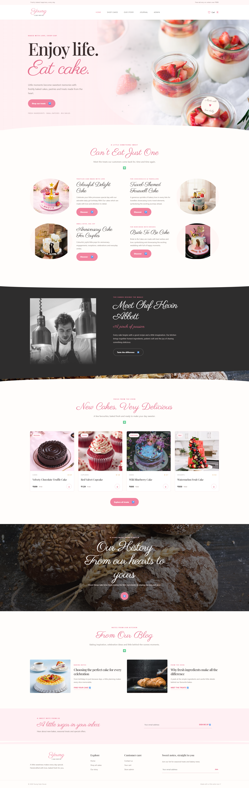

# 🍰 Young Cake House – Blog Management System

A React-based Blog Management System built to practice **components, forms, CRUD operations, routing, hooks, API integration, Redux, searching, sorting, and pagination**.

Visitors can browse and search blogs, while admins can **add, update, delete, and manage** blog records using **React** and **JSON Server**.



---

## Video Explanation

Watch the full walkthrough and feature overview:

> **[Watch Video Walkthrough & Code Explanation](https://drive.google.com/drive/folders/1Sy-R7ooPA5VQssVQF5gRPkkRPH_DMkrQ)**

---

## 📌 Table of Contents

- [Features](#-features)
- [Tech Stack](#-tech-stack)
- [Concepts Covered](#-concepts-covered)
- [Project Structure](#-project-structure)
- [Component Modules](#-component-modules)
- [Routes](#-routes)
- [Blog Form Fields](#-blog-form-fields)
- [Search, Sort & Pagination](#-search-sort--pagination)
- [Admin Dashboard](#-admin-dashboard)
- [Getting Started](#-getting-started)
- [db.json Structure](#-dbjson-structure)
- [Screenshots](#-screenshots)
- [Project Details](#-project-details)
- [Submission Checklist](#-submission-checklist)
- [Author](#-author)

---

## ✨ Features

**For Users**
- View all published blogs
- Read complete blog details
- Search blogs by title or author
- Filter blogs by category
- Sort blogs A–Z, Z–A, Latest, or Oldest
- Navigate through blogs with pagination

**For Admins**
- Dashboard with blog statistics
- Add new blogs with a validated form
- Edit existing blogs
- Delete blogs
- Search and manage all blog records
- Mark blogs as Published or Draft

---

## 🛠️ Tech Stack

| Category        | Technology                    |
| --------------- | ----------------------------- |
| Frontend        | React.js (JSX, Hooks)         |
| Routing         | React Router                  |
| State Mgmt      | Redux (Redux Toolkit)         |
| API Handling    | Axios / Fetch                 |
| Backend (Mock)  | JSON Server                   |
| Styling         | Bootstrap                     |
| Storage         | LocalStorage                  |

---

## 📚 Concepts Covered

- Components & JSX
- Props & State
- Events
- Forms & Validation
- Hooks
- Routing
- CRUD Operations
- Axios / Fetch
- JSON Server
- Redux
- LocalStorage
- Search & Sort
- Filtering
- Pagination
- Bootstrap
- Spread & Rest Operators

---

## 🧱 Project Structure

```
src/
├── components/
│   ├── Header.jsx
│   ├── Footer.jsx
│   ├── BlogCard.jsx
│   ├── BlogForm.jsx
│   ├── SearchBar.jsx
│   └── Pagination.jsx
│
├── pages/
│   ├── Home.jsx
│   ├── Blogs.jsx
│   ├── BlogDetails.jsx
│   └── admin/
│       ├── Dashboard.jsx
│       ├── AddBlog.jsx
│       └── EditBlog.jsx
│
├── redux/
│   ├── store.js
│   └── blogSlice.js
│
└── App.jsx

db.json
```

---

## 🧩 Component Modules

| Component     | Description                          |
| ------------- | ------------------------------------ |
| `Header`      | Navigation bar                       |
| `Footer`      | Footer information                   |
| `BlogForm`    | Add / Edit blog form                 |
| `BlogList`    | Displays the list of blogs           |
| `BlogCard`    | Individual blog card                 |
| `BlogDetails` | Complete blog information            |
| `SearchBar`   | Search blogs                         |
| `Pagination`  | Pagination controls                  |

---

## 🛣️ Routes

| Route              | Page         |
| ------------------ | ------------ |
| `/`                | Home         |
| `/blogs`           | Blog List    |
| `/blogs/:id`       | Blog Details |
| `/admin`           | Dashboard    |
| `/admin/add-blog`  | Add Blog     |
| `/admin/edit/:id`  | Edit Blog    |

---

## 📝 Blog Form Fields

- Blog Title
- Author
- Email
- Category
- Image
- Description
- Content
- Tags
- Publish Date
- Status (Published / Draft)

All fields include form validation before submission.

---

## 🔍 Search, Sort & Pagination

- **Search** by title or author
- **Filter** by category
- **Sort** by:
  - A → Z
  - Z → A
  - Latest
  - Oldest
- **Pagination** to split blog records across pages

---

## 📊 Admin Dashboard

The dashboard displays blog statistics at a glance:

| Total Blogs | Published | Drafts |
| :---------: | :-------: | :----: |
|     25      |    20     |   5    |

Available actions: **Add Blog** · **Edit** · **Delete** · **Search**

---

### Installation

```bash
# 1. Clone the repository
git clone https://github.com/kadamom017/React-js.git

# 2. Move into the project folder
cd Reac-js 

# 3. Install dependencies
npm install
```

### Run the Application

Start JSON Server (in one terminal):

```bash
npx json-server --watch db.json --port 3000
```

Start the React app (in another terminal):

```bash
npm start
```

> If your project uses Vite, use `npm run dev` instead of `npm start`.

The app runs at `http://localhost:3000` (or the port shown in your terminal) and the API at `http://localhost:3000/blogs`. If both use the same port, run JSON Server on a different one (for example `--port 5000`) and update the API base URL in your code.

---

## 🗄️ db.json Structure

```json
{
  "blogs": [
    {
      "id": 1,
      "title": "Choosing the perfect cake for every celebration",
      "author": "Kevin Abbott",
      "email": "kevin@example.com",
      "category": "Baking Notes",
      "image": "https://example.com/cake.jpg",
      "description": "A short summary of the blog.",
      "content": "Full blog content goes here...",
      "tags": ["cake", "celebration"],
      "publishDate": "2026-01-15",
      "status": "Published"
    }
  ]
}
```

---

## 👤 Author

**Your Name**
GitHub: [@kadamom017](https://github.com/kadamom017)

---

Made with a little extra love ♥
