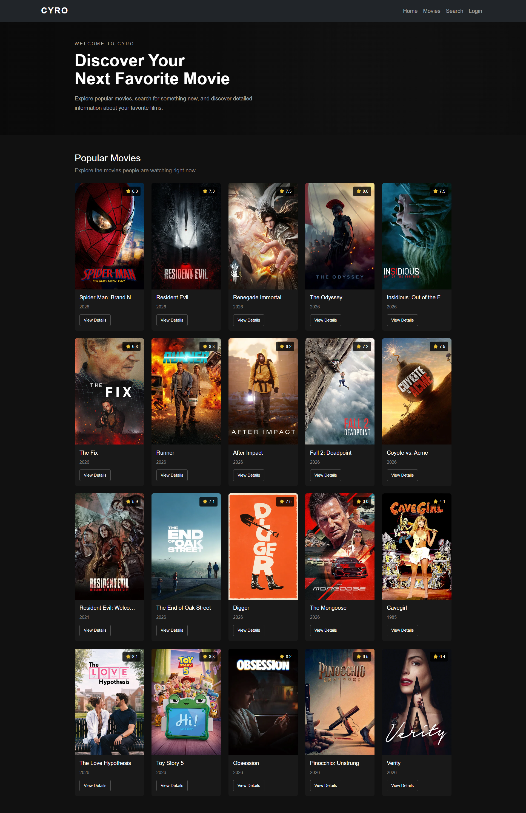
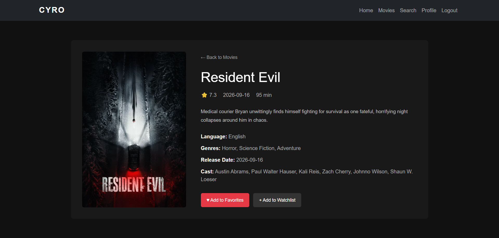
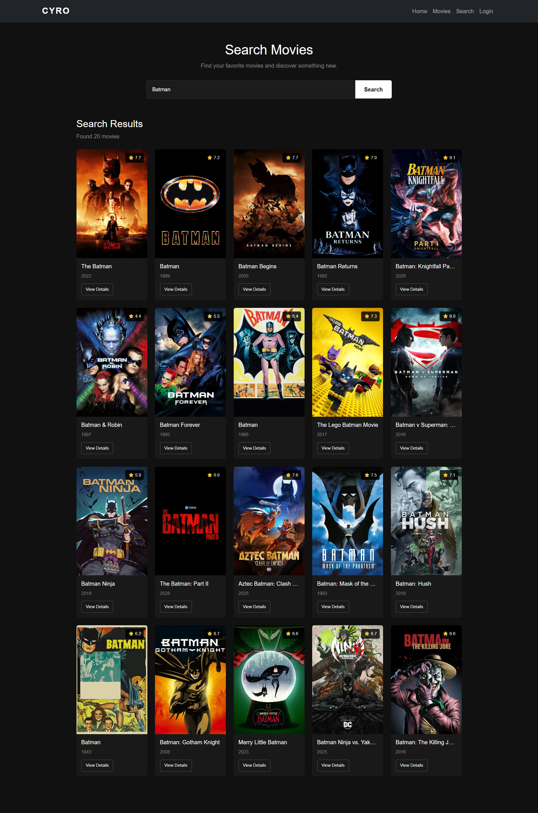
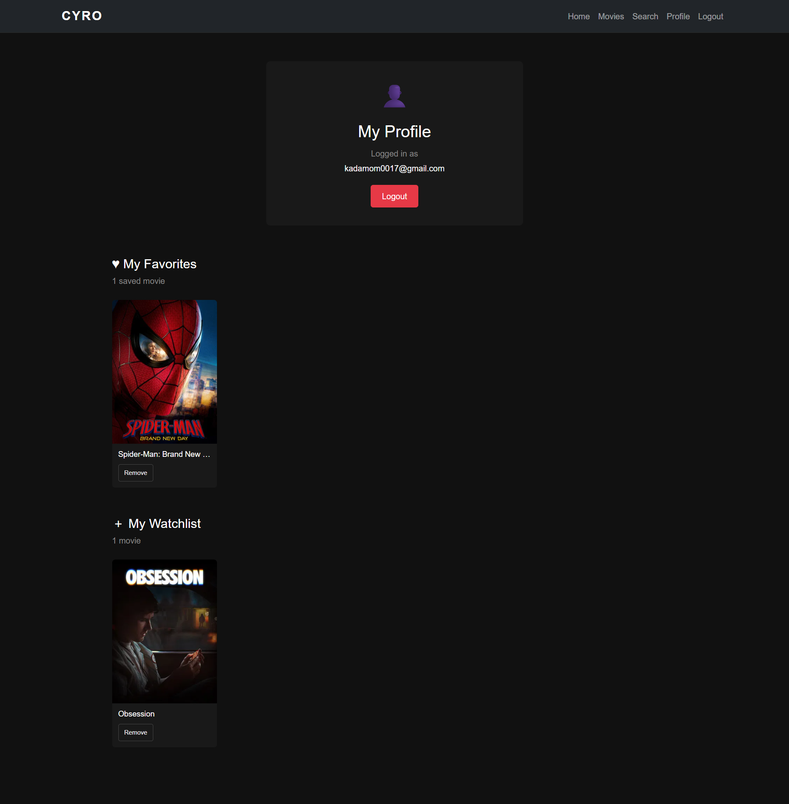
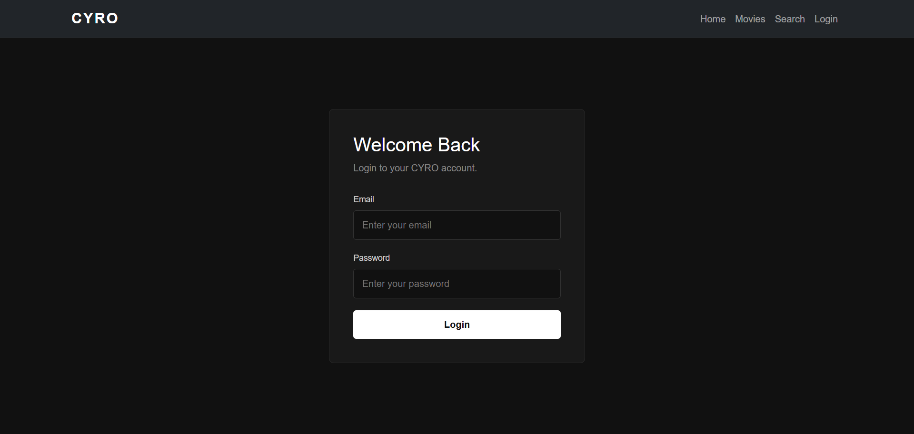

# CYRO - Movie Library

CYRO is a responsive movie library web application built with React and Vite. The application uses the TMDb API to fetch real-time movie information and allows users to explore popular movies, search for movies, view detailed information, and manage their favorite movies and watchlist.

## Screenshots

### 1. Home & Movies Page


### 2. View-Details & Favourites/Wishlist Page


### 3. Search Page


### 4. Profile Page


### 5. Login Page


---

## Features

- Browse popular movies from TMDb
- Search movies dynamically
- View detailed movie information
- Display movie rating and release date
- Display languages and genres
- Display cast information
- Add movies to Favorites
- Add movies to Watchlist
- Simple user authentication
- Login and Logout functionality
- Protected Profile route using PrivateRoute
- View Favorites and Watchlist from Profile
- Loading and error handling
- Responsive design
- Bootstrap styling
- React Router navigation
- Redux Toolkit state management

## Technologies Used

- React.js
- Vite
- JavaScript
- Redux Toolkit
- React Redux
- React Router DOM
- Axios
- Bootstrap
- TMDb API
- HTML5
- CSS3

## Project Structure

```text
cyro-movie-library/
│
├── public/
│
├── src/
│   ├── components/
│   │   ├── MovieCard.jsx
│   │   ├── MovieDetails.jsx
│   │   ├── MovieList.jsx
│   │   ├── MovieSearch.jsx
│   │   ├── Navbar.jsx
│   │   └── PrivateRoute.jsx
│   │
│   ├── pages/
│   │   ├── Home.jsx
│   │   ├── Login.jsx
│   │   └── Profile.jsx
│   │
│   ├── redux/
│   │   ├── authReducer.js
│   │   ├── movieReducer.js
│   │   └── store.js
│   │
│   ├── services/
│   │   └── movieApi.js
│   │
│   ├── App.jsx
│   ├── index.css
│   └── main.jsx
│
├── .env
├── index.html
├── package.json
└── README.md