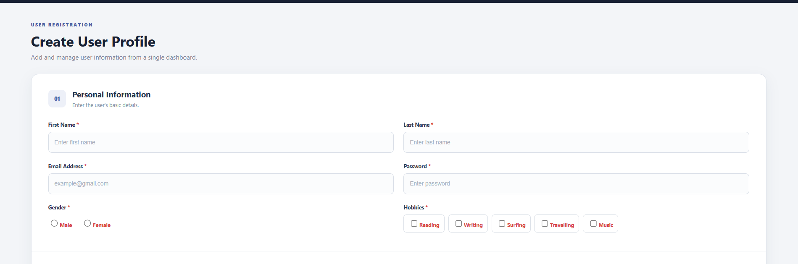
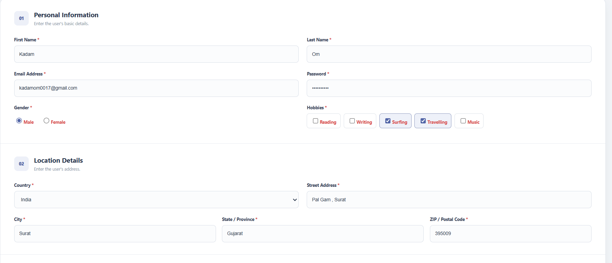
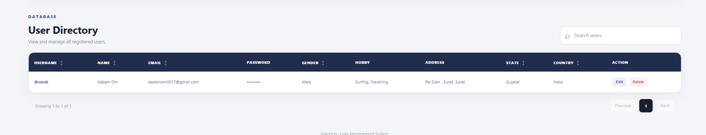
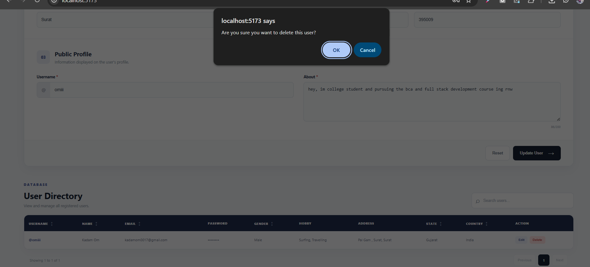

# User Management System

A simple User Management System built using React and Vite.

This project allows users to register their information, view registered users, edit user details, delete users, search users, and sort the user list.

---

## Screenshots

### 1. Profile Form


### 2. Edit Form


### 3. Saved Profiles


### 4. Delete Form


---

## Features

- User registration form
- First name and last name
- Email and password
- Gender selection
- Multiple hobby selection
- Country selection
- Address details
- Username and About section
- Form validation
- Add user
- Edit user
- Delete user
- Search users
- Sort users
- Data stored in Local Storage
- Responsive design

## Technologies Used

- React
- Vite
- JavaScript
- Local Storage

## Installation

```bash
npm create vite@latest my-form

## Project Structure

```

my-form/
│
├── public/
├── src/
│   ├── App.jsx
│   ├── App.css
│   ├── index.css
│   └── main.jsx
│
├── index.html
├── package.json
├── vite.config.js
└── README.md